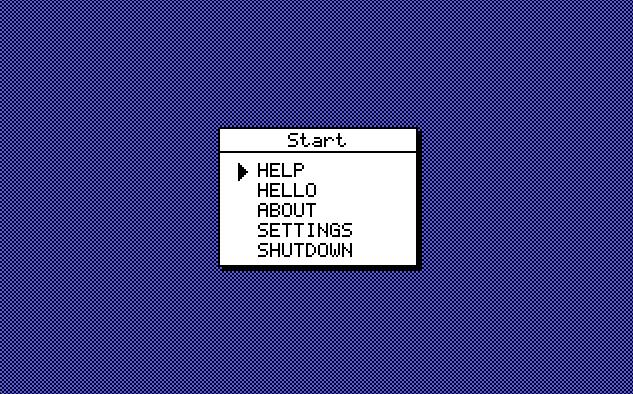

# BaseOS

A tiny 32-bit kernel I'm writing from scratch in C and Assembly. It boots into a custom VGA GUI (Mode 13h) with a few basic apps.



## What is this?

I built this to understand how OS kernels work at the lowest level. It's not POSIX-compliant or anything fancy, but it handles:
- **Booting**: A custom 16-bit bootloader that jumps to 32-bit protected mode.
- **Graphics**: Direct VGA memory writing (320x200, 256 colors) with a custom windowing system and font rendering.
- **Input**: PS/2 keyboard driver.
- **Apps**: A simple menu, a "Hello World" demo, and a Settings page to change the theme.

## How to Run

You'll need `qemu`, `nasm`, and a cross-compiler (like `x86_64-elf-gcc`).

On macOS:
```bash
brew install x86_64-elf-gcc nasm qemu
```

Then just run:
```bash
make run
```

This will compile everything, build the floppy image, and launch QEMU.

## Project Layout

- `boot.asm`: The bootloader.
- `kernel.c`: The entire kernel (graphics, logic, drivers).
- `font.h`: Bitmap font definitions.
- `kernel_entry.asm`: Assembly stub to jump into C code.

## Future Plans

- [ ] Mouse support
- [ ] A simple file system (maybe FAT12?)
- [ ] Text editor

## License

MIT. Use this however you want!
